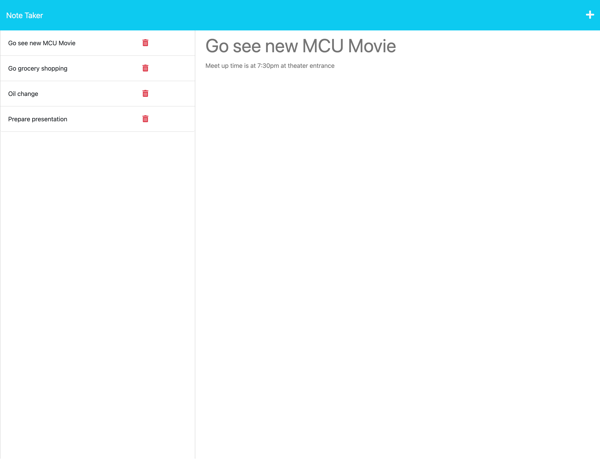

# My Application

[Link to my project on Heroku](https://warm-eyrie-53333.herokuapp.com/)

[Link to my project page](https://github.com/uiido/note-taker-app)

## Table of Contents
- [Description](#description)
- [Visuals](#visuals)

## Description
This is a project that allows the user to make and save notes. Users will create a title and a body for a note of their choice. Once both fields are entered, they will be prompted with a save icon that will save their notes. Users may click on previous notes to view their contents. If a user no longer requires a note, they may click on the delete icon next to the note for it to be permanantly removed.

## Visuals

